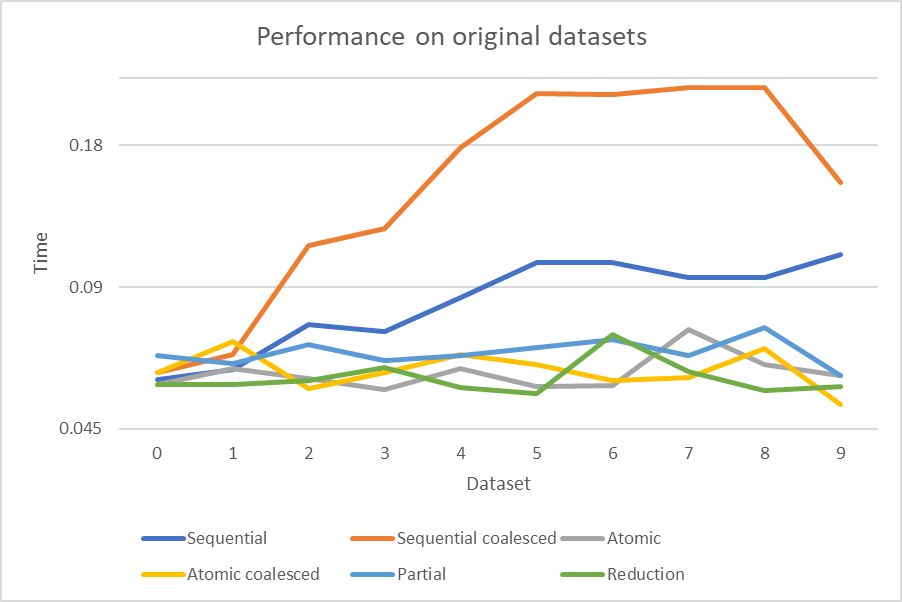
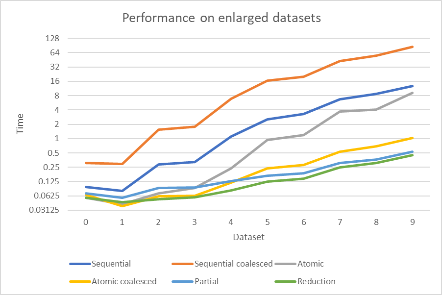

## Various reduction techniques for computing the sum of an array

##### Sequential
A single thread computes the sum for each block, updating the sum locally and then
writing it to the `blockIdx.x` location of the output vector at the end. The thread
iterates through adjacent elements.

##### Sequential coalesced
A single thread computes the sum for each block, updating the sum locally and then
writing it to the `blockIdx.x` location of the output vector at the end. The thread
iterates through elements stepping by `gridDim.x`.

##### Atomic
Each thread computes the sum for some number of elements (based on the number of
input elements, the number of blocks, and the block size). These elements are
adjacent. Each thread attempts to atomically update the `blockIdx.x` location of
the global output array during this iteration.

##### Atomic coalesced
Each thread iterates through some elements of the array, incrementing by
`gridDim.x * BLOCK_SIZE`. Each thread attempts to atomically update the
`blockIdx.x` location of the global output array during this iteration.

##### Partial reduction
An array of size `BLOCK_SIZE` is created in shared memory. Each thread then stores
the sum of some number of elements at the `threadIdx.x` location in shared memory.
Threads are then synced to ensure all writes have completed. Finally, a single
thread computes the sum of the shared array, and stores the result at the
`blockIdx.x` location in the output array.

##### Total reduction
An array of size `BLOCK_SIZE` is created in shared memory. Each thread then stores
the sum of some number of elements at the `threadIdx.x` location in the array.
Threads are then synced, after which the array in shared memory is recursively
reduced by the threads, syncing at each level. The final result should be in the
first element of the shared array, which is then written to the `blockIdx.x`
location of the output array.

NOTE: this implementaiton ensures that all threads are active at the first level of
the reduction by ensuring that the block is responsible for at least
`2 * BLOCK_SIZE` elements, such that each thread can sum at least 2 elements.

## Results

